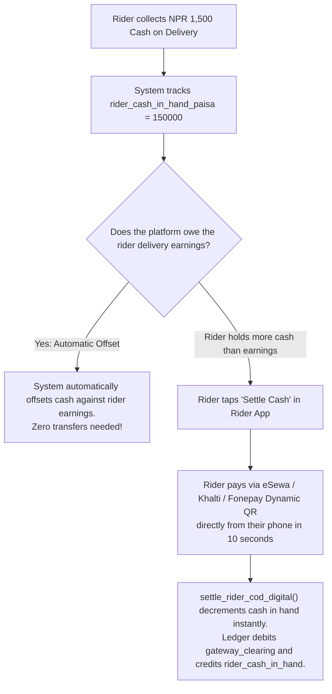

# evrry — Platform Business Logics, Data Dictionary & Operational Guide

> **Platform**: evrry Super App Ecosystem  
> **Company**: Elifsi Technologies Private Limited  
> **Repository**: [https://github.com/Elifsi/Evrry.git](https://github.com/Elifsi/Evrry.git)  
> **Authoritative Specification**: Single source of truth for developers, AI assistants, and operators.  

---

## 1. Platform Philosophy & Business Boundaries

1. **100% Asset-Light Marketplace**:
   - Elifsi owns **zero physical inventory, zero restaurant kitchens, zero hotel properties, and zero vehicle fleets**.
   - All services are provided by independent third-party partners (restaurants, kirana stores, bike riders, taxi drivers, hotel hosts, and property landlords).
   - **Self-drive vehicle fleet rentals are deferred to Phase 2** to avoid capital expenditure on purchasing or leasing vehicle assets.
2. **Strict NRB Compliance (Zero Customer Wallet)**:
   - Operating a stored-value customer wallet requires an expensive Payment Service Provider (PSP) license from Nepal Rastra Bank (NRB) with paid-up capital of NPR 5+ Crore.
   - **evrry maintains NO in-app customer wallet**. All customer payments are processed directly through certified payment gateways (**Fonepay Dynamic QR**, **eSewa**, **Khalti**, **Card rails**) or **Cash on Delivery (COD)**.
3. **Monetary Representation (Integer Paisa)**:
   - Floating-point representations (`FLOAT`, `DOUBLE`, `REAL`) are strictly banned for money.
   - **All currency is stored as integer `BIGINT` paisa** ($1 \text{ NPR} = 100 \text{ paisa}$).
   - Examples: $\text{NPR } 150.00 = 15000 \text{ paisa}$; $\text{NPR } 1,250.50 = 125050 \text{ paisa}$.
4. **Nepal Privacy Act 2018 (Consent-Gated AI)**:
   - AI personalization runs strictly on an opt-in basis (`ai_personalization_consent = true`).
   - If a user withdraws consent, all memories and distilled profiles are immediately deleted via database triggers.
   - Raw chat transcripts are automatically purged after 30 days.
5. **Dual Identity Verification (Phone SMS + Email)**:
   - **Phone Number (SMS OTP)**: Primary sign-in identifier for consumers, riders, and drivers in Nepal.
   - **Email Address (6-Digit OTP / Magic Link)**: Required for partner onboarding, monthly payout statements, and account security.
   - **Unified in Supabase Auth**: Both credentials link to a single `auth.users` entity (`supabase.auth.linkIdentity()`).
   - **Transactional Email Provider Strategy**:
     - *Phase 1 (Testing & Launch)*: **Resend Free Tier** (3,000 emails/month free) for zero-friction Next.js integration.
     - *Phase 2 (High Volume Scale)*: **Amazon SES** ($0.10 per 1,000 emails) for enterprise cost efficiency at scale.
6. **Multi-Business Architecture (Instagram-Style Profile Switcher)**:
   - A single human account (`profiles.id`) can own multiple commercial entities via `partner_profiles.owner_id` (1:N relationship).
   - Partners do **NOT** create multiple accounts to operate different businesses (e.g. a restaurant owner who also rents out a flat upstairs).
   - In-app **Profile Switcher** allows instant 1-tap switching between business profiles without logging out.
   - Tapping **"+ Add New Business"** creates a new profile under a chosen vertical and attaches vertical-specific KYC documents.
7. **Platform Device Division of Responsibility**:
   - **Mobile Partner App (`apps/partner`)**: Supports **ALL 5 verticals** because phone cameras are essential for scanning paper menus, photographing rental rooms, and phone GPS is required for driving.
   - **Desktop Web Dashboard (`apps/web/partner`)**: Strictly for **Stationary Merchants & Hosts** (KDS queues, thermal receipt printers, barcode scanners, room calendars). Zero driving/riding interfaces on web.

---

## 2. Taxation & Cash on Delivery (COD) Mechanics

### A. Value Added Tax (VAT) Policy
- **Current Status**: Elifsi Technologies is pre-VAT registration with the Inland Revenue Department (IRD).
- **Database Knob**: Governed by `public.platform_settings.key = 'vat_bps'`.
- **Default Value**: `0` basis points (**0% VAT**). The platform charges NPR 0 tax across all orders and fees.
- **Future Activation**: When total turnover exceeds the IRD threshold (NPR 50 Lakhs for goods / NPR 20 Lakhs for services), Superadmin updates `vat_bps = 1300` (13%) in `platform_settings`. The server pricing engine immediately begins applying 13% VAT with zero code changes.

### B. Zero-Hub & Zero-Bank COD Digital Settlement
In a physical marketplace, delivery riders collect cash from customers. Asking riders to visit a physical office hub or stand in bank queues every day is slow, expensive, and impractical.

**evrry solves COD 100% digitally through 3 automated mechanisms:**

1. **Automatic Earnings Offset**:
   - Over a week, a rider earns delivery fees from completed orders.
   - In the midnight settlement batch (`admin_build_settlement_batch`), the platform automatically subtracts the COD cash the rider is holding from the delivery fees owed to them:
     $$\text{net\_paisa} = \text{payable\_paisa} - \min(\text{cash\_in\_hand}, \text{payable\_paisa})$$
   - If the platform owes more than the cash held, the net difference is transferred to the rider's bank account. **No physical cash travels anywhere.**
2. **In-App Digital Settlement (`settle_rider_cod_digital`)**:
   - If a rider collects more cash than their earnings, they open the driver app and tap **"Settle Cash"**.
   - They pay Elifsi via **eSewa**, **Khalti**, or by scanning a **Fonepay Dynamic QR** using their mobile banking app.
   - The verified gateway webhook fires `settle_rider_cod_digital()`, which immediately clears their cash-in-hand liability.
3. **COD Safety Limit (`rider_cod_limit_paisa`)**:
   - Set in `platform_settings` (default: NPR 5,000 / 500,000 paisa).
   - If a rider's cash in hand reaches this limit, COD order dispatches are paused until they settle digitally. Prepaid orders remain fully active.
4. **Admin Manual Reconciliation (`admin_reconcile_rider_cash`)**:
   - For rare cases where a rider visits a physical office or directly transfers to Elifsi's corporate bank account, a Superadmin reconciles the payment in the backoffice console, logging the action in `admin_audit_logs`.

---

## 3. Double-Entry Accounting Invariant

Every transaction that touches money writes an append-only entry in `public.platform_ledger`.

- **Ledger Invariant**: Every transaction group (`txn_group`) **MUST BALANCE** ($\sum \text{Debits} = \sum \text{Credits}$).
- **Enforcement**: Guaranteed at commit time by deferred constraint trigger `assert_ledger_group_balanced()`.

| Account Type | Owner | Normal Balance | Purpose |
| :--- | :--- | :--- | :--- |
| `gateway_clearing` | Platform | Debit | Funds collected by Fonepay/eSewa/Khalti awaiting bank settlement to Elifsi |
| `bank_clearing` | Platform | Credit | Outgoing bank transfers via connectIPS / corporate payouts |
| `merchant_payable` | Partner | Credit | Net earnings owed to restaurants and grocery stores |
| `rider_payable` | Partner | Credit | Net delivery fees and ride fares owed to riders and drivers |
| `host_payable` | Partner | Credit | Net booking revenue owed to hotels and homestays |
| `rider_cash_in_hand`| Partner | Debit | Cash on Delivery funds physically held by delivery riders |
| `platform_revenue` | Platform | Credit | Commissions and platform service fees earned by Elifsi |
| `vat_payable` | Platform | Credit | VAT collected from customers owed to the Inland Revenue Department |
| `marketing_expense`| Platform | Debit | Platform-funded discount vouchers and promotional subsidies |
| `refund_expense` | Platform | Debit | Platform-absorbed dispute refunds |

---

## 4. Master Schema & Business Logic Reference

### Migration 0001: Extensions, Enums & Utilities
- **Installed Extensions**: `postgis` (Point coordinates & distance calculations), `btree_gist` (anti-double-booking range exclusions), `pg_trgm` (fuzzy name search), `pgcrypto` (cryptographic hashing & random generation).
- **Core Enums**:
  - `user_role`: `consumer`, `rider`, `driver`, `merchant`, `landlord`, `host`, `admin`, `superadmin`.
  - `partner_type`: `restaurant`, `grocery`, `rider`, `driver`, `hotel`, `landlord`.
  - `partner_status`: `draft`, `pending_verification`, `active`, `rejected`, `suspended`.
  - `order_status`: `draft`, `acknowledged`, `preparing`, `ready_for_pickup`, `dispatched`, `delivered`, `cancelled`, `rejected`.
  - `payment_method`: `fonepay_qr`, `esewa`, `khalti`, `fonepay_direct`, `card`, `cod`.
  - `payment_status`: `initiated`, `pending`, `succeeded`, `failed`, `refunded`, `partially_refunded`.
  - `ride_status`: `requested`, `bidding`, `accepted`, `arrived`, `in_progress`, `completed`, `cancelled`.
  - `vehicle_type`: `bike`, `scooter`, `car`.

### Migration 0002 & 0011: Nepal Administrative Spine
- **Complete Hierarchy**: All 7 Provinces, 77 Districts, 4 Local Level Types (`Metropolitan City`, `Sub-Metropolitan City`, `Municipality`, `Rural Municipality`), and 753 Local Levels.
- **Reference Source**: Bibek Oli dataset (`scripts/generate-geography-seed.py`).
- **Entity Linking**: Every physical address, store, property, and rental listing links directly to `local_levels(id)` and validated `ward_no` (1–35).

### Migration 0003: Identity, Partners & Superadmin Operations
- **`profiles`**: 1:1 sync with `auth.users`. Consumers default to `role = 'consumer'`. Privileged columns (`role`, `status`, `cod_enabled`) can only be modified by Superadmin RPCs.
- **`partner_profiles`**: Business entity holding legal name, PAN, location, and commission rate in basis points (`commission_bps`).
- **`partner_members`**: RBAC for partner staff (`owner`, `manager`, `cashier`).
- **`rider_details`**: Driving license, vehicle plate number, vehicle model, vehicle color, rating average, and cash in hand.
- **`partner_kyc_documents`**: Citizenship, Blue Book, PAN/VAT, Hygiene permits, and Landlord Lalpurja stored in private `kyc` bucket.
- **`admin_audit_logs`**: Append-only audit trail recording every admin approval, ban, refund, and cash reconciliation.
- **`service_kill_switches`**: Ward/Palika emergency switches for natural disasters (floods, landslides) or strikes.

### Migration 0004 & 0012: Food & Grocery Catalog & Orders
- **Server Pricing (`place_order()`)**:
  - Distance computed via PostGIS `ST_Distance(store.location, address.location)`.
  - Rejects carts outside `max_delivery_radius_m` (default: 12 km).
  - Calculates base fee, per-km fee, platform fee, and VAT.
  - Generates 4-digit OTP (`order_handoff_codes`) required for delivery completion.
- **Atomic Stock Reservation**: Per-item inventory (`inventory_items`) uses row-level locking. If order is cancelled before preparation, stock is returned automatically.
- **Packaging & Options**:
  - `catalog_items.packaging_unit`: e.g. `'1 kg'`, `'500 ml'`, `'1 packet'`.
  - `catalog_items.options`: Add-ons and dish variations (e.g. Cheese, Spice level).
  - `order_items.selected_options` & `order_items.item_note`: Preserves customer preferences and dish customizations.

### Migration 0005 & 0012: Stays, Long-Term Rentals & Ride Bidding
- **Hotel Anti-Double-Booking**:
  - `room_reservations.reservation_period` stored as `daterange`.
  - Enforced via `no_double_booking EXCLUDE USING gist (room_id WITH =, reservation_period WITH &&)`.
  - Impossible for concurrent guests to double-book the same room.
- **InDrive-Style Ride Bidding**:
  - Passenger requests a ride with baseline offered fare (`request_ride()`).
  - Drivers within 5 km submit counter-bids (`place_ride_bid()`).
  - Passenger accepts bid (`accept_ride_bid()`), locking the driver and rejecting competing bids.
  - Driver must collect 4-digit start OTP from passenger before `in_progress`.
- **Long-Term Room Rentals (`room_listings`)**:
  - Designed for Kathmandu gharbetis (single room, 1BHK, 2BHK, flat).
  - Direct inquiry creates a lead in `room_enquiries` and opens a direct chat with the landlord.

### Migration 0006 & 0012: Payments, Ledger & Payouts
- **Webhook Gateway Handshake (`confirm_payment`)**:
  - Executable exclusively by `service_role` from Edge Functions.
  - Idempotent: duplicate webhook payloads return existing payment without re-processing.
- **Automated Settlement Postings**:
  - `post_order_settlement()`: Delivers order, debits `gateway_clearing` or `rider_cash_in_hand`, credits `merchant_payable`, `rider_payable`, `platform_revenue`, and `vat_payable`.
  - `post_ride_settlement()`: Debits `rider_cash_in_hand`, credits `rider_payable` and `platform_revenue`.
  - `post_reservation_settlement()`: Debits `gateway_clearing`, credits `host_payable` and `platform_revenue`.
- **Midnight Payout Batches (`settlement_batches` & `payouts`)**:
  - Aggregates partner balances.
  - Automatically offsets rider COD cash.
  - Exports batch for automated connectIPS / Khalti Payout API execution.

### Migration 0007 & 0012: Social Connections & E2EE Chat
- **WeChat-Style Relationship Gate**: Unconnected users cannot initiate direct chats (`connections.status = 'accepted'`).
- **End-to-End Encryption**: Ciphertext stored in `messages.encrypted_payload`.
- **Delivery Receipts**:
  - `mark_messages_delivered(p_chat)`: Updates 'sent' to 'delivered' (double grey ticks).
  - `mark_messages_read(p_chat)`: Updates to 'read' (blue ticks).
- **Ephemeral Media**:
  - `open_and_burn_snap()`: Atomically marks snap `is_burned = true` and returns storage path only to the recipient.
  - `stories`: Auto-expire after 24 hours.

### Migration 0008: Loyalty, Gamification & Referrals
- **Loyalty Leagues**: `copper` (0+), `bronze` (200+), `silver` (800+), `platinum` (2,000+), `diamond` (5,000+).
- **Digital Stamp Cards**: 10 stamps per sheet; rewards customer on completion.
- **Daily Check-In (`daily_check_in()`)**: Evaluated strictly under `Asia/Kathmandu` local midnight to ensure fair streak calculation.
- **Referrals**: Referral codes can only be redeemed prior to the referee's first order.

### Migration 0009: AI Memory, Privacy & Storage Retention
- **`user_ai_profile`**: Deterministic analytical profile of 90-day order habits (spending tier, top dishes, preferred order hour). Refreshes with zero LLM API cost.
- **`user_memories`**: Short user facts (allergies, preferences). Capped at 50 facts; oldest drops automatically.
- **30-Day Auto-Purge**: All raw AI chat messages older than 30 days are purged by scheduled job.
- **Storage Janitor**: Expired story videos and burned snaps are queued into `storage_cleanup_queue` and drained by an Edge Function.

### Migration 0010: Function Privilege Lockdown & Storage RLS
- **Default Privileges Revoked**: Public execution is revoked on internal SECURITY DEFINER functions.
- **Private Storage Buckets**:
  - `kyc`: Private (owner + admin).
  - `catalog`: Public read, partner manager write.
  - `avatars`: Public read, user write.
  - `snaps`: Private (sender upload, recipient view-and-burn).
  - `stories`: Private (RLS inherited from story validity).
  - `chat-media`: Chat members only.

### Migration 0012: Reviews & Operational Enhancements
- **`reviews`**: Unified customer review table for stores, riders, drivers, and hotels.
- **`submit_review()`**: Verified submission ensuring user completed the order/ride/stay. Recomputes average rating and count atomically.
- **Vehicle Visuals**: Adds `vehicle_model` and `vehicle_color` to `rider_details`.
- **Digital COD Settlement**: `settle_rider_cod_digital()` and `admin_reconcile_rider_cash()`.

### Migration 0013: Automated Invoicing & Resend Email Queue
- **`email_dispatch_queue`**: Resilient outbox queue for transactional emails (Invoices, OTPs, KYC notices, Payout statements).
- **`trigger_queue_delivered_order_invoice()`**: Automated PostgreSQL trigger firing on order `status = 'delivered'`. Automatically extracts items, taxes (0% VAT), store PAN, customer address, and queues tax invoice with zero manual client intervention.
- **Idempotency**: `uq_email_order_invoice (reference_id, action)` prevents duplicate invoice dispatches.
- **Client Security Invariant**: Kotlin (Android) and Swift (iOS) binaries NEVER hold `RESEND_API_KEY`. All dispatches route through Supabase Edge Function `send-email/`. See [email-service-resend.md](email-service-resend.md).

### Migration 0014: SMS Verification, Dispatch Logs & Anti-Bombing Rate Limiter
- **`sms_dispatch_logs`**: Tracks all SMS dispatches (Sparrow SMS, Aakash SMS, Mock) with delivery status and `cost_paisa` expenditure.
- **`sms_rate_limits` & `check_sms_rate_limit()`**: Protects platform from SMS bombing attacks. Enforces 45s cooldown, max 3 OTP requests / 10-minute window, and automated 15-minute lockout upon violation.
- **Adaptive Nepal SMS Architecture**: Runs in Mock Mode for zero-cost local testing until `SPARROW_SMS_TOKEN` is provisioned. See [sms-verification-and-auth.md](sms-verification-and-auth.md).

---

## 5. Partner Operations: Hybrid Architecture (Full Manual Control Dashboard + AI Co-Pilot)

The platform adheres to an uncompromising **"AI-Assisted, Human-Controlled"** principle for all merchant, rider, driver, landlord, and hotel operations:

1. **100% Full Manual Dashboards**:
   - Every single operational workflow can be executed completely manually through standard UI screens (forms, tables, sliders, buttons, and switches).
   - Partners never need to use AI for day-to-day operations if they prefer manual entry, or if their device is offline.
2. **AI as an Accelerator (Co-Pilot)**:
   - AI is an assistant that eliminates tedious friction (e.g. photo-scanning a 100-item paper menu to auto-fill draft catalog forms).
   - **Human-in-the-Loop Approval**: AI generated outputs (menu drafts, auto-replies, voice status changes) always present visual confirmations or preview drafts for partner verification before committing to the database.
3. **Core Hybrid Features by Vertical**:
   - **Restaurants & Kitchens**: Full manual KDS order board + Optional photo-to-menu OCR & kitchen voice out-of-stock toggles (*"Momo sakiyo"*).
   - **Kirana & Grocery**: Manual barcode/SKU inventory counters + Optional shelf/bill photo catalog ingestion.
   - **Hotels & Landlords**: Manual room availability calendar & rate inputs + Optional 3-bullet listing drafter & guest FAQ chat auto-responder.
   - **Riders & Drivers**: Interactive map, bidding slider, and manual 4-digit start OTP keypad + Optional hands-free voice co-pilot while driving.
   - **Business Analytics**: Detailed ledger tables and downloadable invoices + Optional plain-Nepali 8:00 AM business voice/text briefing.
