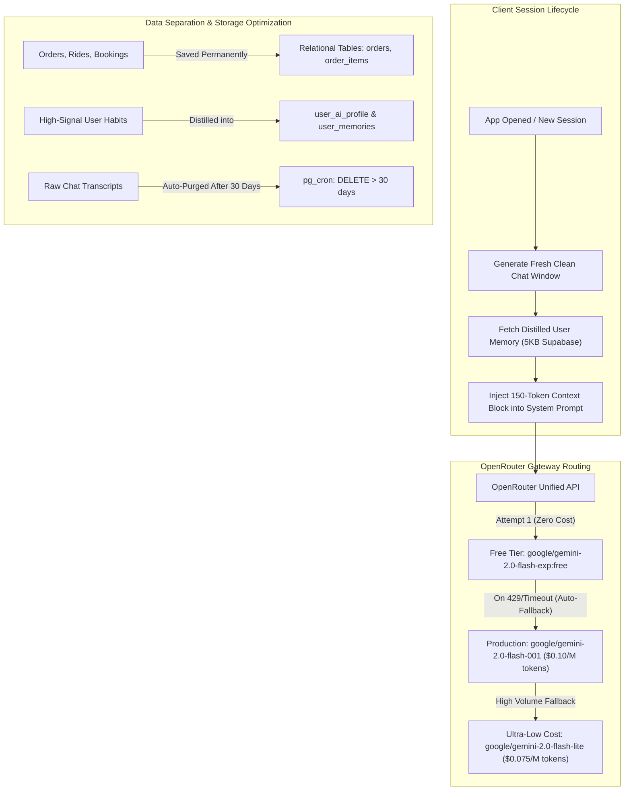

# evrry — Dependencies Master Specification

> **Platform**: evrry Super App Ecosystem  
> **Company**: Elifsi Technologies Private Limited  
> **Repository**: [https://github.com/Elifsi/Evrry.git](https://github.com/Elifsi/Evrry.git)  

---

## 1. Complete Dependencies Master List

### A. AI Voice Gateway Backend (`services/ai-voice-gateway/requirements.txt`)
- `fastapi>=0.110.0` & `uvicorn[standard]>=0.28.0`: High-speed asynchronous WebSocket server for bidirectional audio and cart events.
- `faster-whisper>=1.0.0`: Local STT library processing 16kHz raw PCM bytes directly in memory with low latency.
- `piper-tts>=1.2.0`: Local neural TTS engine producing Hindi and Nepali speech waveforms (`.onnx` checkpoints).
- `openai>=1.14.0`: Client library to call your local vLLM / Ollama instance via standard OpenAI tool-calling schemas.
- `asyncpg>=0.29.0`: Asynchronous PostgreSQL driver for fast read-only catalog queries directly to Supabase.
- `numpy>=1.26.0`: Raw audio buffer manipulation and PCM conversion.

### B. Server-Side Infrastructure & Docker Engines
- **Docker & Docker Compose**: Orchestrates all containers into a unified local network.
- **vLLM / Ollama**: Hosts open-weights LLMs (`Qwen/Qwen2.5-14B-Instruct` or `32B`) with continuous batching and GPU acceleration.
- **Self-Hosted Supabase / PostgreSQL**: Core relational store with `pgvector` enabled for phonetic/semantic search.
- **Redis**: In-memory caching for live driver coordinates (`GEOADD`), active carts, and socket states.
- **OSRM Backend (`ghcr.io/project-osrm/osrm-backend`)**: Self-hosted routing engine using the `nepal-latest.osm.pbf` dataset to compute road polylines, distances, and ETAs in under 10 milliseconds with **zero Google Maps API polyline fees**.
- **Caddy / Nginx**: Reverse proxy managing SSL/TLS termination and routing secure `wss://` WebSocket streams.

### C. Android Native Client (`apps/consumer/android/build.gradle.kts`)
- `com.google.android.gms:play-services-maps`: Free native Google Maps SDK for mobile map viewing and pin rendering.
- `com.google.android.gms:play-services-location`: Hardware GPS tracking (`FusedLocationProviderClient`).
- `com.google.firebase:firebase-messaging-ktx`: Background push notifications via FCM.
- `io.github.jan-tennert.supabase:bom:3.0.0` (`postgrest-kt`, `auth-kt`, `realtime-kt`, `storage-kt`): Official Supabase Kotlin Multiplatform SDK.
- `io.ktor:ktor-client-okhttp:2.3.12`: Networking engine for Supabase and low-latency audio WebSockets.
- `org.jetbrains.kotlinx:kotlinx-serialization-json`: Fast JSON serialization for cart events and API payloads.
- `khalti-android-sdk` or webview intent integration: Payment settlement for eSewa, Khalti, and cards.

### D. iOS Native Client (`apps/consumer/ios`)
- `GoogleMaps` (CocoaPods/SPM): Free visual map surface and marker placement.
- `CoreLocation`: Native iOS hardware GPS location provider with background navigation support.
- `FirebaseMessaging`: APNs bridge for background push notifications.
- `supabase-swift` (`PostgREST`, `Auth`, `Realtime`, `Storage`): Official Supabase Swift package.
- `AVFoundation`: Low-level audio recording via `AVAudioEngine` and live voice playback node.
- Standard payment web redirection / deep-link handler for Khalti and eSewa.

---

## 2. The AI4Bharat Speech & Transliteration Stack

AI4Bharat (developed by IIT Madras) provides state-of-the-art open-source models built specifically for Indian and Nepali languages and accents. While Whisper and Piper are lightweight generalists, AI4Bharat handles regional nuances, mixed dialects, and Romanized script.

### A. Speech-to-Text (ASR) — IndicConformer
- Native support for 22 scheduled regional languages, including **Nepali (`ne`)**, **Hindi (`hi`)**, and **Maithili (`mai`)**.
- Significantly higher accuracy than base Whisper for heavy local accents, street audio, and rural acoustic environments.

### B. Text-to-Speech (TTS) — `ai4bharat/indic-parler-tts`
- Open-weight neural TTS (Apache 2.0 license) supporting 20+ regional languages.
- Allows controlling tone, gender, and pacing directly via prompt tags (e.g., *"Aditi speaks in an expressive, cheerful tone at a normal pace"*).

### C. Romanized Text Parsing — `ai4bharat-transliteration`
- Users frequently text in Roman English (e.g., typing *"ek plate momo pathaideu"*).
- This library converts Romanized phonetic words directly into Devanagari script (एक प्लेट मोमो पठाइदेऊ) before querying the database or passing the text to the LLM.

### D. AI4Bharat Python Dependencies (`services/ai-voice-gateway/requirements.txt`)
```plaintext
torch>=2.2.0
torchaudio>=2.2.0
transformers>=4.40.0
parler-tts>=0.2.0
ai4bharat-transliteration>=1.1.3
soundfile>=0.12.1
```

---

## 3. Push Notification Pipeline (FCM + APNs)

Push notifications cannot rely on open WebSockets because mobile operating systems kill background network connections to preserve battery. When the user locks their phone, Firebase Cloud Messaging (FCM) and Apple Push Notification service (APNs) take over.

```
[ Backend Event ] ──► [ Redis Task Queue / Celery ]
                              │
                              ▼
                   [ Push Notification Worker ]
                              │
               ┌──────────────┴──────────────┐
               ▼                             ▼
       [ Firebase (FCM) ]             [ Apple (APNs) ]
               │                             │
               ▼                             ▼
      Android Device (Kotlin)        iOS Device (Swift)
```

### Operational Workflow
1. **Token Registration**: On app launch, Kotlin/Swift grabs the device push token and posts it to Supabase table `user_push_tokens (user_id, fcm_token, apns_token, platform)`.
2. **Event Triggers**:
   - **Order Lifecycle**: Triggered when the restaurant accepts, when the rider picks up food, and when the rider arrives at the gate.
   - **Ride Alerts**: Driver arrival, OTP generation, and trip completion.
   - **Safety Ping**: Sent immediately to designated family contacts when an emergency alert is triggered.
3. **Backend Service (`services/notification-worker`)**:
   - Driven by `firebase-admin>=6.4.0` in Python.
   - Listens to Postgres table changes (via Supabase database webhooks) or reads events off a Redis stream to dispatch push alerts instantly.

---

## 4. Payments, Payouts & Cash on Delivery (Nepal Fintech Integration)

*(Note: In-app customer wallets have been completely eliminated to remove NRB stored-value PSP licensing liabilities. All checkouts flow directly through payment gateways, cards, or Cash on Delivery).*

### A. Consumer Payment Rails
1. **Fonepay Dynamic QR (Supermarket IMS Model)**:
   - Server calls Fonepay API with locked `total_amount` and unique system `remarks` (e.g. `EVRRY-ORD-10492`).
   - Customer can scan from any bank app, or screenshot and send via WhatsApp/Viber to friends (who upload via **"Scan from Gallery"**).
   - Screen blurs on scan, auto-advances upon instant server webhook IPN receipt.
2. **Direct Wallet / App Hosted Redirection (eSewa, Khalti, Fonepay Direct)**:
   - The mobile app redirects to the gateway's official secure hosted page/app via deep link.
   - User login and SMS OTP verification occur strictly on the provider's server (zero credentials in evrry).
   - Deep links back to `evrry://checkout/callback?status=success&pidx=...`.
3. **Card Payments (Visa, Mastercard, SCT)**:
   - Hosted 3D-Secure card sheets powered directly via Khalti & eSewa (zero raw card storage).
4. **Cash on Delivery (COD)**:
   - Physical cash collected by delivery rider upon arrival; verified with a 4-digit recipient OTP handshake.

### B. Driver & Restaurant Payouts & Cash Reconciliation
- **connectIPS (NCHL API) or Khalti Connect Payout API**:
  - Partners register legal Bank Account Number and Branch Code.
  - At midnight, the automated settlement engine runs:
    - **Merchants**: Digital payout of total sales minus commission.
    - **Riders**: Net Delivery Fares minus COD Cash Collected in Hand. Excess COD cash collected is offset against next shift earnings or deposited via dynamic Fonepay QR.

### C. Automated Direct Refunds
If a restaurant rejects an order or no rider is found within 7 minutes:
- **Direct Gateway Reversal**: The backend issues an automated API call to Khalti's `/api/v2/payment/refund/` or eSewa/Fonepay reversal API using the original transaction reference, crediting the customer's bank account directly.
- **COD Orders**: Zero transaction reversal needed if order is cancelled prior to rider arrival.

---

## 5. Real-Time Tracking & Family Emergency Sharing

Safety requires two separate tracking channels: **In-App Encrypted Chat** for registered contacts, and a **Public Web Link** for external sharing (SMS, WhatsApp, Viber).

```
                      [ Rider App (GPS Broadcaster) ]
                                     │
                                     │ (Lat, Lng every 3 seconds)
                                     ▼
                    [ Redis Geospatial Engine (GEOADD) ]
                                     │
     ┌───────────────────────────────┼───────────────────────────────┐
     ▼                               ▼                               ▼
[ Active Customer ]         [ In-App Family Chat ]        [ Public Web Tracker ]
  Live tracking on            Encrypted channel with        Signed URL: /track/{token}
  Google Map view             real-time pin updates         No app installation needed
```

### Driver GPS Pipeline
- The rider's app captures high-accuracy GPS coordinates via `FusedLocationProviderClient` (Kotlin).
- Every 3 seconds, it pushes `{ ride_id, lat, lng, bearing, speed }` over the WebSocket.
- Redis stores the latest coordinates in an in-memory key: `SET ride:{id}:location`.

### In-App Family Safety Share
- In the encrypted chat architecture, the customer taps **"Share Live Ride with Family"**.
- Sends a special message type (`type: "LIVE_RIDE_SHARE"`) containing `ride_id` into the chat room.
- When family members open the chat, the message card mounts an embedded live map subscribing to the same Redis coordinates channel.

### External Link Safety Share
- If a family member does not have the app installed, the customer taps **"Share Trip Link"**.
- The backend generates a cryptographically signed, short-lived web link:
  `https://evrry.com.np/track/tr_8f93a1b?sig=e3b0c44...`
- The link opens a lightweight Next.js/HTML page on any mobile browser (Safari, Chrome) showing the vehicle moving along the road towards the destination in real time.

---

## 6. Staged Deployment & Testing Strategy (Zero-Cost Dev to Production)

To eliminate infrastructure costs and reduce operational complexity during active development, the ecosystem utilizes a two-phase rollout model:

```mermaid
flowchart TD
    subgraph Phase 1: Rapid Development & Zero-Cost Testing
        A["Google Colab GPU + vLLM + Cloudflare Tunnel"]
        B["Supabase Managed Cloud (Free Tier)"]
        C["Phone Prototype & Native Test Builds"]
        C <--> A
        C <--> B
    end

    subgraph Phase 2: Production Launch
        D["Dedicated Bare-Metal / Cloud GPU (vLLM)"]
        E["Self-Hosted Supabase (Docker Compose)"]
        F["Live EVRRY Mobile Apps (Play Store / App Store)"]
        F <--> D
        F <--> E
    end

    Phase 1 -. "Update .env endpoints (Zero Code Changes)" .-> Phase 2
```

### A. Phase 1: Rapid Development & Model Testing
1. **vLLM on Google Colab**:
   - Utilize free/low-cost Colab T4 GPUs (16GB VRAM) for 7B/8B parameter models (`Qwen/Qwen2.5-7B-Instruct`, `meta-llama/Llama-3.1-8B-Instruct`) or 4-bit AWQ quantized 14B models.
   - Run the standard OpenAI-compatible API server:
     ```bash
     python3 -m vllm.entrypoints.openai.api_server \
       --model Qwen/Qwen2.5-7B-Instruct \
       --port 8000
     ```
   - Expose the port to development clients using a secure tunnel:
     ```bash
     cloudflared tunnel --url http://localhost:8000
     ```
   - **Model Agnosticism**: Switching between models (Qwen, Llama, Gemma, Mistral) requires no client code modifications because all calls use standard OpenAI `/v1/chat/completions` tool schemas.
2. **Supabase Cloud Free Tier**:
   - Development databases, authentication, realtime subscriptions, and storage buckets run on managed Supabase free tier.
   - All migrations, RLS policies, seeds, and PostGIS spatial functions are tested in this managed environment.

### B. Phase 2: Production Deployment
1. **Dedicated GPU Server**:
   - Transition vLLM to a dedicated GPU instance (bare-metal RTX 4090, A4000, or cloud A10G/A100) running the official vLLM Docker container.
2. **Self-Hosted Supabase**:
   - Run the official Supabase Docker Compose stack on your dedicated server.
   - Export and migrate the database using `supabase db dump` and `psql` restore.
3. **Zero Code Changes**:
   - Transitioning between Phase 1 and Phase 2 only requires updating environment variables in the client and gateway `.env` files:
     ```env
     # Phase 1 -> Phase 2
     NEXT_PUBLIC_SUPABASE_URL="https://api.evrry.com.np"
     NEXT_PUBLIC_SUPABASE_ANON_KEY="<production-anon-key>"
     LLM_BASE_URL="https://llm.evrry.com.np/v1"
     LLM_MODEL="Qwen/Qwen2.5-14B-Instruct"
     ```

---

## 7. AI Memory, Personalization & OpenRouter Gateway Architecture

To maximize revenue through personalized upsells while keeping API and database storage costs near zero, the platform decouples long-term user memory from transient chat logs.



### A. OpenRouter Gateway & Cost Control
- **Unified Interface**: All LLM requests conform to standard OpenAI Chat Completion schemas (`/v1/chat/completions`) with tool definitions (`addToCart`, `checkRideFare`, `bookHotelRoom`).
- **Tiered Model Routing**:
  1. *Testing Phase*: `google/gemini-2.0-flash-exp:free` and `meta-llama/llama-3.3-70b-instruct:free`.
  2. *Production Phase*: `google/gemini-2.0-flash-001` (~$0.10/1M tokens) with `google/gemini-2.0-flash-lite` backup.
- **Billing Transparency**: OpenRouter bills strictly for successful token generations; failed or rate-limited upstream attempts incur $0.00.

### B. Distilled User Memory & Profit Maximization
Rather than resending expensive chat histories, the AI maintains a persistent behavioral profile in Supabase:
1. **Deterministic Behavioral Profile (`public.user_ai_profile`)**:
   - `spending_tier`: `budget` | `mid` | `premium` (computed from 90-day Average Order Value).
   - `top_categories`: Frequency-weighted tags (e.g., `["food:momo", "grocery:dairy", "ride:moto"]`).
   - `routine_schedule`: Habit markers (e.g., lunch order at 13:00, office commute at 09:15).
   - `dietary_constraints`: `["vegetarian", "halal", "peanut-allergy"]`.
2. **Semantic Memory Extraction (`public.user_memories`)**:
   - Extracted during conversation via background tool `save_user_memory(category, fact)`.
   - Stored as concise bullet points (max 50 facts per user, taking < 5 KB total).
3. **Upsell Context Injection**:
   - Each fresh session receives a compressed prompt block:
     ```text
     USER PROFILE & REVENUE DIRECTIVES:
     - Name: Rahul | Tier: Premium Spender
     - Frequent Habits: Orders Newari/Momo lunch ~1:00 PM; buys dairy on Tuesday.
     - Commute: Motorbike to Baneshwor on weekday mornings.
     - Profit Goal: Suggest complementary sides/drinks, highlight flash grocery deals, and prompt routine re-orders.
     ```

### C. 30-Day Chat Retention & Separation of Orders
- **Fresh Window on Launch**: The user receives a clean, uncluttered conversation window upon app launch, avoiding infinite scrolling of stale interactions.
- **30-Day Purge**: Automated background job cleans up raw conversational logs:
  ```sql
  DELETE FROM public.ai_chat_messages WHERE created_at < NOW() - INTERVAL '30 days';
  ```
- **Historical Order Lookups**: When asked *"What did I order last Friday?"*, the AI calls `query_user_orders()` directly against the permanent `public.orders` and `public.order_items` tables, completely unaffected by chat purges.


