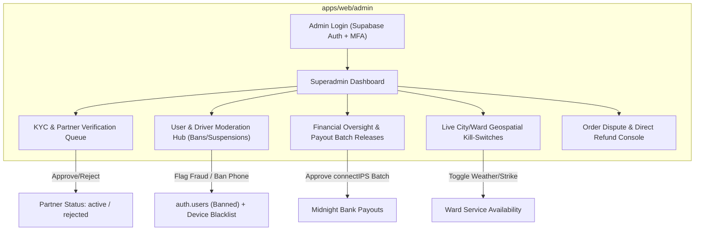

# evrry — Superadmin Operations & KYC Platform Specification

> **Platform**: evrry Super App Ecosystem  
> **Company**: Elifsi Technologies Private Limited  
> **Repository**: [https://github.com/Elifsi/Evrry.git](https://github.com/Elifsi/Evrry.git)  
> **Application Target**: `apps/web/admin` (Next.js App Router, TypeScript, TanStack Table v8, Tremor)

---

## 1. System Role & Security Boundaries

The **Superadmin Console** is the internal command center operated exclusively by **Elifsi Technologies** operations, support, and compliance personnel. It governs platform safety, fraud prevention, regulatory compliance, and multi-vertical partner onboarding.

### A. Access Control & Strict Security (RBAC)
- **Role Requirement**: Governed by `public.profiles.role = 'superadmin'` or `'admin'` in Supabase.
- **Multi-Factor Authentication (MFA)**: Mandatory TOTP (Google Authenticator / Authy) enforced via Supabase Auth before dashboard entry.
- **Session Security**: Validated strictly via Server Components and `@supabase/ssr` middleware. No service-role keys are exposed to client-side bundles.
- **Immutable Audit Logging (`public.admin_audit_logs`)**:
  - Every administrative action (approvals, rejections, bans, refunds, commission changes) writes an immutable record:
    ```sql
    CREATE TABLE public.admin_audit_logs (
      id UUID PRIMARY KEY DEFAULT gen_random_uuid(),
      admin_id UUID NOT NULL REFERENCES public.profiles(id),
      action_type TEXT NOT NULL, -- e.g. 'PARTNER_VERIFIED', 'USER_BANNED', 'DISPUTE_REFUNDED'
      target_entity TEXT NOT NULL, -- e.g. 'merchant:492', 'user:891'
      previous_state JSONB,
      new_state JSONB,
      reason TEXT NOT NULL,
      ip_address TEXT,
      created_at TIMESTAMPTZ NOT NULL DEFAULT NOW()
    );
    ```

---

## 2. Core Operational Modules



---

### A. Partner Onboarding & KYC Verification Engine

Partners (restaurants, kirana stores, bike riders, taxi drivers, hotel managers, room landlords) sign up through the mobile partner app or web portal. Their status defaults to `pending_verification`.

#### Document Inspection Requirements by Vertical:
1. **Riders & Taxi Drivers**:
   - Nepali Driving License (scanned front & back + expiration date verification).
   - Vehicle Registration Document (*Blue Book / Bilbuk*): Tax clearance stamp check.
   - National Identity: Citizenship Card (*Nagarikta*) or National ID number.
   - Vehicle photo with visible number plate.
2. **Restaurants & Groceries (Merchants)**:
   - PAN / VAT Registration Certificate issued by Inland Revenue Department (IRD).
   - Business Registration Document (Office of Company Registrar or local Palika/Ward permit).
   - Food Quality / Hygiene Permit (for dining establishments).
   - Bank Account Verification (Account Name must match PAN/VAT entity for automated payouts).
3. **Hotels & Room Rental Landlords**:
   - Citizenship verification.
   - Property Ownership Certificate (*Lalpurja*) or legally registered lease agreement.

#### Superadmin Verification UI Workflow:
- Split-screen document viewer: High-resolution zoomable viewer for submitted IDs alongside OCR-extracted form data.
- **One-Click Actions**:
  - `🟢 Verify & Approve`: Automatically transitions `merchants.status = 'active'`, provisions product catalog access, and dispatches an automated SMS/Push notification: *"Welcome to EVRRY! Your store/vehicle is now live."*
  - `🔴 Reject with Reason`: Prompts admin for structured rejection feedback (e.g., *"Blue Book tax stamp is illegible, please re-upload"*). Dispatches actionable re-upload link to the partner.

---

### B. User Moderation, Fraud Detection & Ban Controls

Protects the platform from abusive customers, fake orders, fraudulent drivers, and bad actors.

1. **Global Entity Search**:
   - Instant search across users, orders, phone numbers, vehicle registration numbers, and device fingerprints.
2. **Disciplinary Actions**:
   - **Temporary Suspension**: Disables account login for 1–30 days (e.g. repeated cancellations after rider dispatch).
   - **COD Disablement**: If a customer repeatedly refuses delivery of Cash on Delivery orders, admin sets `profiles.cod_enabled = false`. The user can only order via prepaid Fonepay/eSewa/Card.
   - **Permanent Account Ban**: Revokes Supabase Auth refresh tokens and marks `profiles.status = 'banned'`.
   - **Device & Phone Blacklist**: Records hashed hardware UUIDs and phone numbers to prevent re-registration using burner SIMs.

---

### C. Financial Settlement & Payout Oversight

Works hand-in-hand with [`docs/architecture/payouts.md`](file:///home/rahul/codes/Evrry/docs/architecture/payouts.md):
- **Midnight Batch Release**: Operations managers inspect the aggregated connectIPS / Khalti Payout batch before automated execution.
- **Rider Cash-in-Hand Monitor**: Flags riders who have collected excessive Cash on Delivery (COD) without clearing their balance.
- **Dynamic Commission Overrides**: Set platform take-rates per vertical or customized merchant contracts (e.g. standard 15% on dining, 8% for anchor supermarket chains).

---

### D. Geospatial Kill-Switches & City Management

Integrates with the Nepal administrative spine (`provinces`, `districts`, `local_levels`):
- **Live City Kill-Switch**: If heavy rainfall, landslides, or road strikes occur in Kathmandu, Pokhara, or Narayanghat, admins can toggle delivery or rides offline for that specific Palika or Ward with a single switch.
- **Surge Pricing Controller**: Configure dynamic weather or rush-hour multipliers for driver fares.

---

### E. Order Dispute & Refund Management

When a customer reports an issue (missing items, spoiled food, driver no-show):
- Customer support views the complete trip/order log: chat transcript, rider GPS route breadcrumbs, timestamps, and order photos.
- **Direct Refund Trigger**: Admin issues an automated refund call via Khalti / eSewa / Fonepay reversal API, crediting the customer's original payment method directly.
- **Merchant / Rider Penalty**: Admin can debit the faulty party's ledger balance or forgive unintentional delivery delays.

---

## 3. Technology Stack & Directory Placement

| Layer | Specification | Location |
|---|---|---|
| **Framework** | Next.js 15+ (App Router, Server Actions, RSC) | `apps/web/admin` |
| **Data Tables** | TanStack Table v8 (sorting, filtering, pagination) | `apps/web/admin/components/tables` |
| **Analytics & Metrics** | Tremor / Recharts / Tailwind CSS | `apps/web/admin/components/metrics` |
| **Maps & Tracking** | Mapbox GL / Leaflet (driver pins, ward polygons) | `apps/web/admin/components/map` |
| **Backend & Auth** | Supabase Auth (`admin` role check) + `@supabase/ssr` | `apps/web/admin/lib/supabase` |
