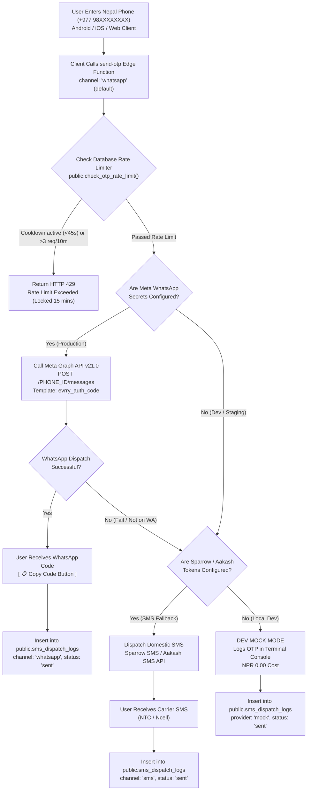

# WhatsApp OTP Verification & Multi-Channel Authentication Architecture
**evrry Super App Platform**  
*Elifsi Technologies Private Limited*

---

## 1. Executive Summary & Why WhatsApp Over SMS in Nepal

Traditional domestic SMS in Nepal (Sparrow SMS, Aakash SMS) faces several operational challenges:
- **Telco Network Congestion**: During peak traffic hours or carrier routing incidents, SMS delivery delays can range from 30 seconds to several minutes, leading to user drop-offs.
- **Do-Not-Disturb (DND) & Carrier Spam Filtering**: Telecom operators periodically filter transactional SMS containing alphanumeric characters or trigger false positives.
- **Cost**: Carrier SMS costs NPR 1.10 – 1.40 per attempt with zero read receipts or interactive UX.

In contrast, **WhatsApp** is installed on over 92% of smartphones across urban and semi-urban Nepal. By switching to the **Meta WhatsApp Business Cloud API (Graph API v21.0)** as the primary verification rail:
1. **Near-Zero Latency**: OTP messages arrive via IP push notification in **under 1.5 seconds**.
2. **Interactive 1-Tap Copy Code**: WhatsApp provides a native **"Copy Code"** button (and on Android, 1-tap autofill) directly within the notification or chat bubble.
3. **Official Brand Verification**: Messages arrive from the official **"evrry"** verified business profile with green tick badge, eliminating phishing fears.
4. **Resilient Dual-Rail Failover**: If a recipient does not have WhatsApp or Meta returns a delivery failure, the backend automatically falls back to domestic SMS (Sparrow/Aakash SMS).
5. **Zero-Cost Development Mode**: Runs in Dev Mock Mode locally without requiring Meta or SMS credentials.

---

## 2. Multi-Channel Failover Flowchart



---

## 3. Meta WhatsApp Cloud API Setup

### A. Required Meta Business Secrets
Configure these in Supabase Edge Function Secrets (`supabase secrets set`):
```bash
supabase secrets set WHATSAPP_ACCESS_TOKEN="EAA..."
supabase secrets set WHATSAPP_PHONE_NUMBER_ID="109876543210987"
supabase secrets set WHATSAPP_TEMPLATE_NAME="evrry_auth_code"
supabase secrets set WHATSAPP_LANGUAGE_CODE="en_US"
```

### B. Meta Authentication Template (`evrry_auth_code`)
In Meta Business Manager > WhatsApp Manager > Message Templates:
- **Category**: `AUTHENTICATION`
- **Template Name**: `evrry_auth_code`
- **Languages**: English (`en_US`) & Nepali (`ne`)
- **Body**:
  `Your evrry security code is {{1}}. Valid for 10 minutes. Do not share this code.`
- **Buttons**:
  - Type: `OTP`
  - Subtype: `COPY_CODE`
  - Text: `Copy Code`

---

## 4. Database Schema & Anti-Bombing Rate Limiter

Applied in [`supabase/migrations/20261005000019_whatsapp_otp_and_channel_dispatch.sql`](file:///home/rahul/codes/Evrry/supabase/migrations/20261005000019_whatsapp_otp_and_channel_dispatch.sql):

### 1. `sms_dispatch_logs` Multi-Channel Enhancement
- `channel`: `'whatsapp' | 'sms'`
- `provider`: `'whatsapp_cloud' | 'sparrow' | 'aakash' | 'mock' | 'twilio'`
- `template_name`: e.g. `'evrry_auth_code'`
- `cost_paisa`: WhatsApp (~NPR 2.00) vs SMS (~NPR 1.20) vs Mock (NPR 0.00)

### 2. Unified Anti-Bombing Rate Limiting
- **Sequential Cooldown**: Min 45 seconds between consecutive attempts.
- **Sliding Window Quota**: Max 3 attempts per 10 minutes.
- **Lockout**: Exceeding quota locks phone number across all channels for 15 minutes.

---

## 5. Client Integration Code Examples

### Android Consumer & Partner (Kotlin)
```kotlin
// Request WhatsApp OTP (Primary)
val result = authService.requestWhatsAppOtp("9812345678")
result.onSuccess { response ->
    println("OTP sent via: ${response.channel}")
}

// Verify Code entered by user
authService.verifyPhoneOtp("+9779812345678", "849201")
```

### iOS Consumer & Partner (Swift)
```swift
// Request WhatsApp OTP
let response = try await authService.requestWhatsAppOtp(phoneNumber: "9812345678")

// Verify Code entered by user
try await authService.verifyPhoneOtp(phoneNumber: "+9779812345678", token: "849201")
```

### Web / Next.js (TypeScript)
```typescript
import { EvrryWebAuthClient } from '@/apps/web/common/auth';

const auth = new EvrryWebAuthClient();

// Request WhatsApp OTP
const res = await auth.requestWhatsAppOtp('9812345678');

// Verify OTP
await auth.verifyPhoneOtp('+9779812345678', '849201');
```

---

## 6. How to Test Right Now (Zero Cost)

1. Make a POST request or run the client app:
   ```bash
   curl -X POST http://localhost:54321/functions/v1/send-otp \
     -H "Content-Type: application/json" \
     -d '{"phone": "9812345678", "channel": "whatsapp"}'
   ```
2. The terminal immediately logs the mock WhatsApp OTP:
   ```
   ===================================================================
   💬 [WHATSAPP OTP GATEWAY — DEV MOCK MODE]
   Recipient:   +9779812345678 (Local: 9812345678)
   Channel:     WHATSAPP
   OTP Code:    [ 849201 ]
   Template:    evrry_auth_code (Interactive 'Copy Code' button)
   Cost:        NPR 0.00 (Mocked development mode)
   Notice:      Set WHATSAPP_ACCESS_TOKEN & WHATSAPP_PHONE_NUMBER_ID in Supabase secrets to go live.
   ===================================================================
   ```
3. Use `849201` to authenticate instantly!
